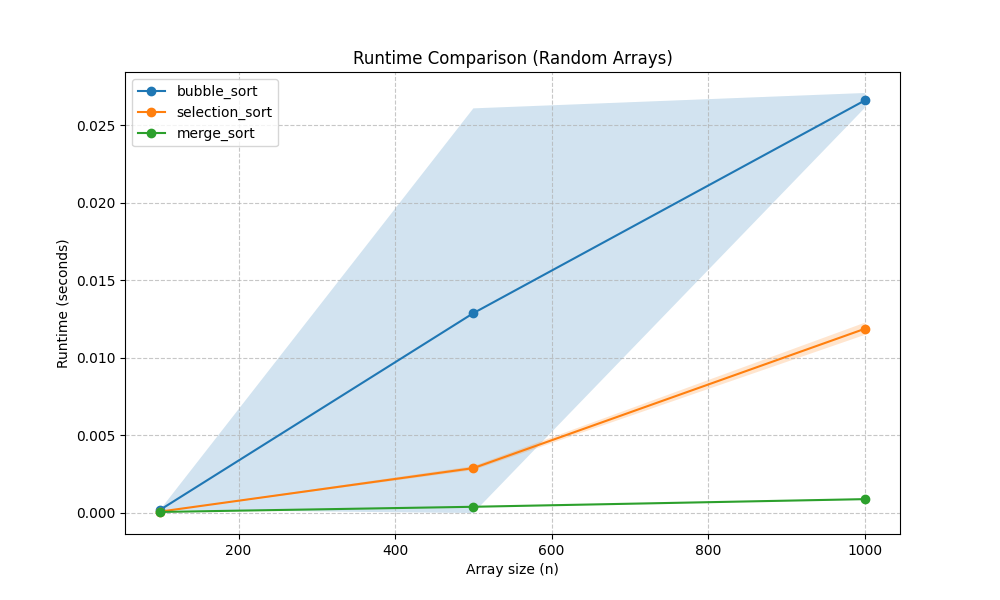
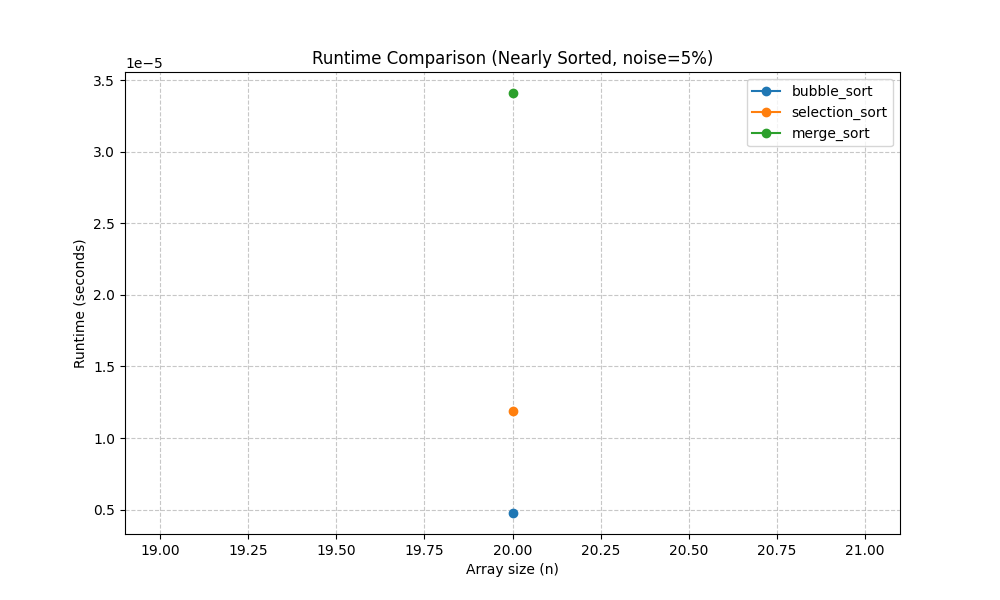

# Sorting_Assignment

## Student Names
Tomer Dvoskin  
Maya Mashiah

## Selected Algorithms
- Bubble Sort (ID 1)
- Selection Sort (ID 2)
- Merge Sort (ID 4)

### Theoretical Time Complexity

| Algorithm | Best Case | Average Case | Worst Case |
| :--- | :--- | :--- | :--- |
| **Bubble Sort** | O(N) | O(N²) | O(N²) |
| **Selection Sort** | O(N²) | O(N²) | O(N²) |
| **Merge Sort** | O(N log N) | O(N log N) | O(N log N) |

## Figure 1: Random Arrays (`result1.png`)

**Results Explanation:** 
This figure compares the running times of the three algorithms as the input size N increases, using arrays populated with completely random integers. As expected from theoretical time complexities, **Merge Sort** performs significantly better. Its growth curve remains very flat relative to the others due to its efficient O(N log N) scalability. Conversely, **Bubble Sort** and **Selection Sort** exhibit a much steeper, parabolic growth curve. This clearly illustrates their heavier O(N²) average and worst-case complexities when processing unstructured data.

## Figure 2: Nearly Sorted Arrays (`result2.png`)

**Results Explanation:**
In this experiment, the algorithms process an array that is already sorted but has a small amount of "noise" added (either 5% or 20% of elements swapped). 

When compared to the completely random arrays in Figure 1, the running times change dramatically based on how each algorithm handles structural order:
- **Bubble Sort:** We observe a massive improvement in performance. Because our code implementation includes an early-stopping mechanism (a boolean `swapped` flag), Bubble Sort can rapidly skip over the sorted sections of the data. This brings its execution time incredibly close to its O(N) best-case scenario.
- **Selection Sort:** The running time barely changes compared to Figure 1. This is because Selection Sort is fundamentally blind to existing order; it must scan the entirety of the unsorted section to find the minimum element on every single pass, remaining rigidly bound to O(N²).
- **Merge Sort:** The performance remains consistently fast. Merge Sort divides and conquers the array identically regardless of the data's internal arrangement, steadily maintaining its optimal O(N log N) time framework.
